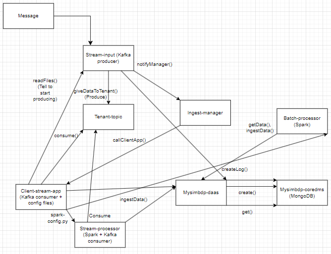

# Assignment Assignment_3  792295

- Note: Spark connections fail so the system is not functional. (No batch analysis implemented also, except in theory.)

Structure of the system:



Tenant data sources: Tenants inputs data into mysimbdp stream-input as messages.

Mysimbdp messaging system: If the message aligns with the tenant agreement, mysimbdp gets data from stream-input by using Kafka to create a producer for that message that procuces the messages for the specific tenants topic after the Client-stream-app requests stream-input for the data trough a REST API call giveDataToTenant(). Stream-input calls mysimbdp ingest-manager to inform that it has messages for a specific tenant through REST API call notifyManager(). Kafka is chosen as the messaging system due to fast an easy to use generally. It also works well with Spark so it fits well for the different type of analytics done here. Also I already used it in previous assignments.

Tenant streaming analytics app: Client-stream-app creates a consumer (using Kafka or some other MQTT, we don't know due to it being a black box) that consumes the messages from mysimbdp stream-input topic specific for the tenant, by first telling the stream-input to produce the messages, after the mysimbdp ingest-manager has scheduled and called the Client-stream-app through REST API call callClientStreamApp().

Mysimbdp streaming computing service: Stream-processor in mysimbdp that uses Spark to create consumer that get the data from tenants messages in message queues at mysimbdp stream-input. Calculates the average temperature and humidity from the tenant data for the specific window. Tenants provide their specific streaming logic as python files tha are configured to work with our mysimbdp Spark processor. So each tenant has their own Stream processor and Batch processor running on our platform with their specific configuration files that fit the tenant data schemas. Spark was chosen due to being able to be configured with Kafka with specific API. Spark also has pretty easy computing logic for calculating data and is fast for calculating averages.

Ingesting data to mysimbdp-coredms: Client-stream-app can ingest raw data by calling mysimbdp-daas API which ingest the data into mysimbdp-coredms (MongoDB). The tenants Spark processor with their specific configurations is connected to mysimbdp-coredms due to running on our platform and ingest the processed data of the average temperature and humidity to mysimbdp-coredms. - -  - Processed data is a JSON document:
```json
{
  "tenantId": "String",
  "timestamp": "String",
  "avg_temperature": "String",
  "avg_humidity": "String"
}
```

Batch analysis: Mysimbdp batch-processor does batch analysis on the tenant data stored in mysimbdp-coredms by calculating the average monthly temperature and monthly humidity every month based the timestamps on the specific tenants data and then stores the analyzed data to mysimbdp-coredms. Gets the data from mysimbdp-coredms to analyze and inserts the processed data every month. Runs on our platform and is configured by the tenants configuration file.