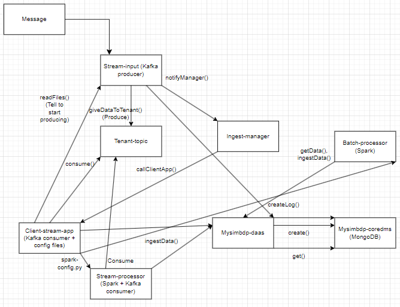

# Report for assignment 3

## Part 1

### 1. Tenant data and data analytics
- Data samples based on: Open data about air quality monitoring from Germany (https://github.com/opendata-stuttgart/meta/wiki/EN-APIs)

- Dataset is suitable for data analytics because it consistently has the temperature and humidity values given regularly. These can easily be used to calculate averages and make predictions about the future or gather up old data for statistics.

```json
{
  "id": "String",
  "sampling_rate": "String",
  "timestamp": "String",
  "location": {
    "id": "String",
    "latitude": "String",
    "longitude": "String",
    "altitude": "String",
    "country": "String",
    "exact_location": "String",
    "indoor": "String"
  },
  "sensor": {
    "id": "String",
    "pin": "String",
    "sensor_type": {
      "id": "String",
      "name": "String",
      "manufacturer": "String" 
    }
  },
  "sensordatavalues": [
    {
      "id": "String",
      "value": "String",
      "value_type": "String" // temperature
    },
    {
      "id": "String",
      "value": "String",
      "value_type": "String" // humidity
    }
  ]
}
```

- (i): Streaming analytics calculate the averages from the multiple sensor values like temperature and humidity in order to analyze current messages going throught the stream.

- (ii): Batch analytics is performed on the tenant sensor data in mysimbdp-coredms (MongoDB) every month, based on the metadata timestamp, to get the monthly averages for the temperature and humidity from all tenat sensors.


### 2. Data streams
- (i): Streaming analytics should only handle keyed data streams which have metadata that identifies the tenant the data belongs to. The keys in the data streams allow for the identification of tenant data and without the key we cannot be sure the correct tenants data is analyzed at every point.

- (ii): Suitable message delivery guarantees are at-most-once and exactly-once. At-most-once allows for a fast system and with the large amounts of data being processed the loss of a couple data points won't affect the analysis outcome as much. Exactly-once would be ideal for data integrity, but implementing it adds a lot of checks to the systems and delays which decreases performance by notable amounts. At-least-once is not suitable for these analytics due having a large chance of interfering with the outcome if there are too many duplicate datapoints.


### 3. Stream Processing Considerations: Time, Windows, Out-of-Order Data, and Watermarks

- (i): Types of time to consider with stream data sources for the analytics are event time, ingestion time and processing time. Event time is the time when the event actually occurred and is usually embedded in the data record itself. Ingestion time is the time taken when the data is ingested into the stream processing system. Processing time is the time when the event is processed by the stream processor. If the data sources have no timestamps associated with records, a solution could be to attach a timestamp at the point of ingestion into the stream processing system.

- (ii): Types of windows should be tumbling windows and sliding windows. Tumbling windows are better for regular intervals of data, so if the data is consistently arriving to be processed tumbling windows are better. Sliding windows are better when the data is inconsistently arriving to be processed, so if the data is irregular they should be used. No window would just mean handling the data rigidly when it arrives which does not give a lot to analyze in terms of amount of data.

- (iii): Out-of-order data/records could be caused by the mycoresimbdp input-stream Kafka producer problems, tenants consumer problems, network delays, buffering or sensor issues. For example, if the sensor data is being transmitted over a network, then network congestion or failures could cause some data records to arrive late at the stream processor, resulting in out-of-order data.

- (iv): Watermarks are probably needed for the system to function, because without them creating a window for the stream processor is difficult and inaccurate. They allow for the handling of out-of-order and delayed data.


### 4. Collect logging metrics
- Store tenant logs in individual tenant database paths. At logs/tenantId.

#### Metrics stored:
- dataSizeBytes, Measured by: The size of the data packet received for processing. Relevance: Understand the volume of data being processed
- ingestionStartTime, Measured by: The timestamp when the data ingestion process starts. Relevance: Track the time taken for data ingestion.
- ingestionEndTime, Measured by: The timestamp when the data ingestion process ends., Relevance: Calculate the total time taken for data ingestion.
- ingestionResult, Measured by: The outcome of the data ingestion process (success or failure). Relevance: Success rate of data ingestion and error logging.
- timestamp, Measured by: The timestamp for the metric log creation. Relevance: General logging.


### 5. Architecture


Tenant data sources: Tenants inputs data into mysimbdp stream-input as messages.

Mysimbdp messaging system: If the message aligns with the tenant agreement, mysimbdp gets data from stream-input by using Kafka to create a producer for that message that procuces the messages for the specific tenants topic after the Client-stream-app requests stream-input for the data trough a REST API call giveDataToTenant(). Stream-input calls mysimbdp ingest-manager to inform that it has messages for a specific tenant through REST API call notifyManager(). Kafka is chosen as the messaging system due to fast an easy to use generally. It also works well with Spark so it fits well for the different type of analytics done here. Also I already used it in previous assignments.

Tenant streaming analytics app: Client-stream-app creates a consumer (using Kafka or some other MQTT, we don't know due to it being a black box) that consumes the messages from mysimbdp stream-input topic specific for the tenant, by first telling the stream-input to produce the messages, after the mysimbdp ingest-manager has scheduled and called the Client-stream-app through REST API call callClientStreamApp().

Mysimbdp streaming computing service: Stream-processor in mysimbdp that uses Spark to create consumer that get the data from tenants messages in message queues at mysimbdp stream-input. Calculates the average temperature and humidity from the tenant data for the specific window. Tenants provide their specific streaming logic as python files tha are configured to work with our mysimbdp Spark processor. So each tenant has their own Stream processor and Batch processor running on our platform with their specific configuration files that fit the tenant data schemas. Spark was chosen due to being able to be configured with Kafka with specific API. Spark also has pretty easy computing logic for calculating data and is fast for calculating averages.

Ingesting data to mysimbdp-coredms: Client-stream-app can ingest raw data by calling mysimbdp-daas API which ingest the data into mysimbdp-coredms (MongoDB). The tenants Spark processor with their specific configurations is connected to mysimbdp-coredms due to running on our platform and ingest the processed data of the average temperature and humidity to mysimbdp-coredms.  
- Processed data is a JSON document:
```json
{
  "tenantId": "String",
  "timestamp": "String",
  "avg_temperature": "String",
  "avg_humidity": "String"
}
```

Batch analysis: Mysimbdp batch-processor does batch analysis on the tenant data stored in mysimbdp-coredms by calculating the average monthly temperature and monthly humidity every month based the timestamps on the specific tenants data and then stores the analyzed data to mysimbdp-coredms. Gets the data from mysimbdp-coredms to analyze and inserts the processed data every month. Runs on our platform and is configured by the tenants configuration file.


Previous assignment code used: All in the assignment_1_code_used folder, docker-compose.yml parts, Dockerfile, index.js, logger.js, database_api folder, some components have parts reused but changed.


## Part 2

### 1. Data schema and analytics output
##### (i):
Data schema for sensor data:
```json
{
  "id": "String",
  "sampling_rate": "String",
  "timestamp": "String",
  "location": {
    "id": "String",
    "latitude": "String",
    "longitude": "String",
    "altitude": "String",
    "country": "String",
    "exact_location": "String",
    "indoor": "String"
  },
  "sensor": {
    "id": "String",
    "pin": "String",
    "sensor_type": {
      "id": "String",
      "name": "String",
      "manufacturer": "String" 
    }
  },
  "sensordatavalues": [
    {
      "id": "String",
      "value": "String",
      "value_type": "String" // temperature
    },
    {
      "id": "String",
      "value": "String",
      "value_type": "String" // humidity
    }
  ]
}
```

- This type of data format with the temperature and humidity needs to be mandated in order for the data analytics to be possible.

Stream-processor calculates the average temperature and humidity (avg_temp, avg_humidity).
Batch-processor calculates the average monthly temperature and humidity (avg_monthly_temp, avg_monthly_humidity).

```json
{
  "tenantId": "String",
  "timestamp": "String",
  "avg_monthly_temperature": "String",
  "avg__monthlyy humidity": "String"
}
```

##### (ii):
- Data is deserialized by the client-stream-app consumer and stream-processor consumer from a message back to JSON data (using Kafka in example). Data stays as JSON as long as possible due to the ease of creating a document-model database using MondoDB and utilizing it fully.


### 2. Tenant-stream-app
Tenant streaming analytics app: Client-stream-app creates a consumer (using Kafka or some other MQTT, we don't know due to it being a black box) that consumes the messages from mysimbdp stream-input topic specific for the tenant, by first telling the stream-input to produce the messages, after the mysimbdp ingest-manager has scheduled and called the Client-stream-app through REST API call callClientStreamApp().

Mysimbdp streaming computing service: Stream-processor in mysimbdp that uses Spark to create consumer that get the data from tenants messages in message queues at mysimbdp stream-input. Calculates the average temperature and humidity from the tenant data for the specific window. Tenants provide their specific streaming logic as python files tha are configured to work with our mysimbdp Spark processor. So each tenant has their own Stream processor and Batch processor running on our platform with their specific configuration files that fit the tenant data schemas. Spark was chosen due to being able to be configured with Kafka with specific API. Spark also has pretty easy computing logic for calculating data and is fast for calculating averages.

Ingesting data to mysimbdp-coredms: Client-stream-app can ingest raw data by calling mysimbdp-daas API which ingest the data into mysimbdp-coredms (MongoDB). The tenants Spark processor with their specific configurations is connected to mysimbdp-coredms due to running on our platform and ingest the processed data of the average temperature and humidity to mysimbdp-coredms.

Batch analysis: Mysimbdp batch-processor does batch analysis on the tenant data stored in mysimbdp-coredms by calculating the average monthly temperature and monthly humidity every month based the timestamps on the specific tenants data and then stores the analyzed data to mysimbdp-coredms. Gets the data from mysimbdp-coredms to analyze and inserts the processed data every month. Runs on our platform and is configured by the tenants configuration file.

- Client-stream-app wrangles data by adding a tenant id and timestamp to all data before sending it through a REST API in mysimbdp-daas to ingest it to mysimbdp-coredms.

### 3. Testing client-stream-app
- Test data is generated based on the schema given earlier using a randomized generator utility function in the tests themselves.

### 4. 
- 

### 5. 
Parallelism is implemented by tenants having dedicated topics, stream-processors and batch-processors defined by their tenant id. Too many tenants would mean that the platform has to run so many instances of spark processors that the infrastructure can't handle it.


## Part 3

### 1. RESTful service
- Tenants client-stream-app can just send the processed data retrieved from mysimbdp-coredms to the RESTful API using the defined API call and then ingest the returned analyzed data to mysimbdp-coredms.

- API endpoint defining, get data to send, transform data to fit the requirements and finally handle return data (ingest to mysimbdp-coredms).

### 2. Batch analytics
Batch analysis: Mysimbdp batch-processor does batch analysis on the tenant data stored in mysimbdp-coredms by calculating the average monthly temperature and monthly humidity every month based the timestamps on the specific tenants data and then stores the analyzed data to mysimbdp-coredms. Gets the data from mysimbdp-coredms to analyze and inserts the processed data every month. Runs on our platform and is configured by the tenants configuration file.

- Get tenant data from mysimbdp-coredms through a REST API with filtering for datapoints that have a timestamp for a specific month.
- Use Spark to get the average monthly temperature and average monthly humidity from the retrieved data. Also add tenant id and timestamp.
- Ingest the processed data to mysimbdp-coredms by calling the REST API defined in mysimbdp-daas.

```json
{
  "tenantId": "String",
  "timestamp": "String",
  "avg_monthly_temperature": "String",
  "avg__monthlyy humidity": "String"
}
```

### 3. Analysis with connected workflow
- Data Monitor: Monitors data streams and identifies critical situations.
->
- Critical Situation Identifier: Triggers an event for deeper analysis upon identification.
->
- Task Coordinator: Manages the execution of subsequent tasks upon receiving the event.
->
- Historical Data Analyst: Analyzes historical data upon receiving the trigger.
->
- Cloud Storage Updater: Stores the results in a cloud storage service for accessibility.
->
- User Notifier: Sends a notification to the user about the availability of the analyzed data.

### 4. Schema evolution
Versioning in the schema and data. Always show schema version as a property.

- Schema registry.

- Schema detection.

- Schema change notification for whole system.


### 5. 
Exactly-once would be ideal for data integrity, but implementing it adds a lot of checks to the systems and delays which decreases performance by notable amounts. The original messages sent to stream-input should have watermarks, then the stream-input should also utilize it's own watermarks, then the client-stream-app and stream-processor should have watermarks. Then finally the batch-processor would need to implement some kind of checking and data integrity mechanism. Would be overall very cumbersome and inefficient.